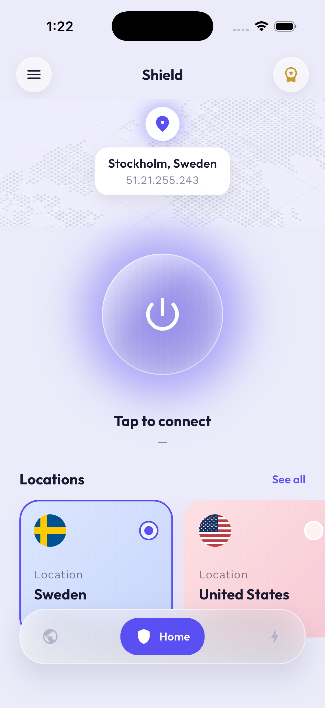
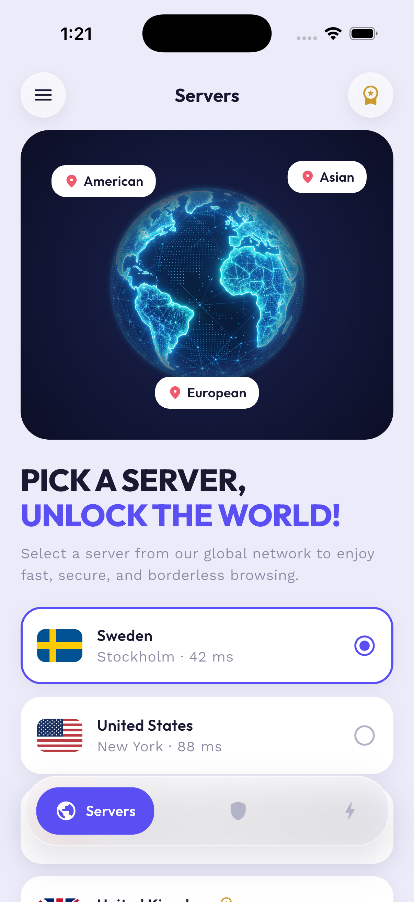
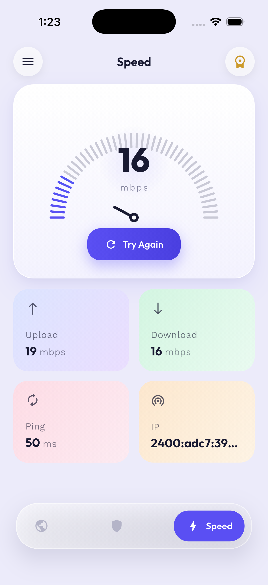

# 🛡️ Shield VPN

A modern, commercial‑grade **cross‑platform VPN app** built with **Flutter**, backed by a real **WireGuard** server. Clean lavender/indigo UI with liquid‑glass surfaces, real network data, and a WireGuard tunnel engine ready to wire up.

> **Status:** Phase 0 complete — working WireGuard server + full app UI with real IP & speed‑test data. The native tunnel engine is abstracted and ready to activate (Phase 0b).

---

## 📱 Screenshots

| Home | Servers | Speed test |
|:---:|:---:|:---:|
|  |  |  |

---

## ✨ Features

- **Liquid‑glass UI** — frosted, translucent power button and floating navigation bar (real backdrop blur).
- **Home** — big glowing connect button, current location pill, horizontal server cards with country flags.
- **Servers** — glowing 3D globe hero, selectable global server list.
- **Speed test** — **real** download/upload/ping measured against public speed endpoints, animated gauge.
- **Real network data** — live public IP + geo lookup; no mock numbers.
- **WireGuard‑ready** — a `VpnEngine` abstraction (`MockVpnEngine` for the UI today, `WireGuardEngine` stub for the real tunnel).

---

## 🏗️ Architecture

A "Flutter VPN" is **Flutter UI ↔ native OS tunnel extension ↔ VPN server ↔ backend**. Dart cannot tunnel OS traffic itself — the native extension (`NEPacketTunnelProvider` on iOS, `VpnService` on Android) does.

```
Flutter UI (Dart)
   │  MethodChannel / EventChannel
   ▼
Native tunnel extension  ──►  WireGuard server (AWS EC2, Stockholm)
   (iOS / Android)
```

```
app/lib/
  main.dart
  theme/            # colors + Outfit/Work Sans typography
  models/ data/     # VpnServer model, static server list, NetworkService
  state/            # VpnController (provider)
  vpn/              # VpnEngine abstraction: Mock + WireGuard(stub)
  widgets/          # LiquidGlass, PowerButton, SpeedGauge, nav, cards…
  screens/          # Home · Servers · Speed
```

---

## 🚀 Getting started

```bash
cd app
flutter pub get
flutter run
```

Requires Flutter 3.x, and Xcode (iOS) / Android SDK.

---

## 🔌 Wiring the real WireGuard tunnel (Phase 0b)

1. Enable `wireguard_flutter` in `app/pubspec.yaml` and `flutter pub get`.
2. iOS: add a Network Extension target + App Group + entitlements.
   Android: the plugin registers the `VpnService` (consent dialog on first run).
3. Swap `MockVpnEngine()` → `WireGuardEngine()` in `main.dart`.

The tunnel config the backend hands out is the standard WireGuard `[Interface]/[Peer]` block.

---

## 🗺️ Roadmap

- [x] **Phase 0** — WireGuard server + full app UI, real IP & speed data
- [ ] **Phase 0b** — activate the native WireGuard tunnel
- [ ] **Phase 1** — backend (`/servers`, `/connect` dynamic peer creation)
- [ ] **Phase 2** — subscriptions (RevenueCat) + paywall
- [ ] **Phase 3** — multi‑country server fleet (Terraform/Ansible)
- [ ] **Phase 4** — obfuscation / "custom" stealth mode (AmneziaWG / XRay)

See [`VPN_IMPLEMENTATION.md`](VPN_IMPLEMENTATION.md) for the full architecture guide covering WireGuard, OpenVPN, and custom‑protocol approaches.

---

## 🧰 Tech stack

Flutter · Dart · Provider · google_fonts (Outfit + Work Sans) · country_flags · http · WireGuard · AWS EC2
